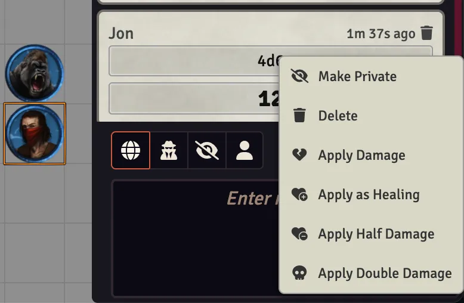

# Damage Context Menu — Black Flag / Tales of the Valiant

> **⚠️ Disclaimer:** This module was created by an AI coding agent (Hephaestus, via Hermes Agent) under the direction of Jon Michaels. While tested and functional, users should verify behavior in their own games before relying on it in critical sessions.

Adds a right-click context menu to any roll chat card with numeric results, allowing the GM to apply the value as damage, healing, half damage, or double damage to selected tokens on the canvas.

Works with:
- **Black Flag / ToV** damage cards (respects damage types, magical properties)
- **D&D 5E** damage cards (via DamageRoll detection)
- **Generic `/r` rolls** (e.g., `/r d20`, `/r 1d8`, `/r 4d6`)

## Installation

1. Go to **Add-on Modules** → **Install Module**
2. Paste the manifest URL: `https://github.com/jonmichaels/bf-damage-menu/releases/latest/download/module.json`
3. Click **Install**

## Requirements

- **Foundry VTT** v13+
- **Black Flag Roleplaying** (Tales of the Valiant) system v2.0+ (required dependency)

## Usage

1. Roll anything numeric: a Black Flag attack, a 5E spell, or just `/r 4d6`
2. Select one or more tokens on the canvas
3. Right-click the chat card
4. Choose from the context menu:

| Option | Multiplier | Effect |
|--------|-----------|--------|
| **Apply Damage** | 1× | Deals the rolled damage |
| **Apply as Healing** | -1× | Heals instead of damaging |
| **Apply Half Damage** | 0.5× | Applies half the rolled damage |
| **Apply Double Damage** | 2× | Applies double the rolled damage |

All options use Black Flag's built-in damage pipeline (resistances, immunities, vulnerabilities, temp HP).

## License

MIT
